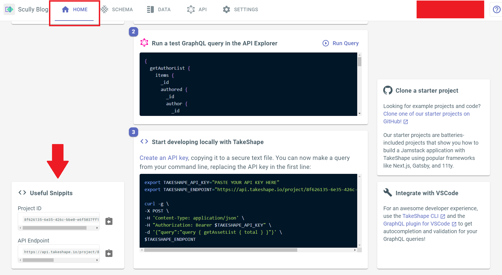
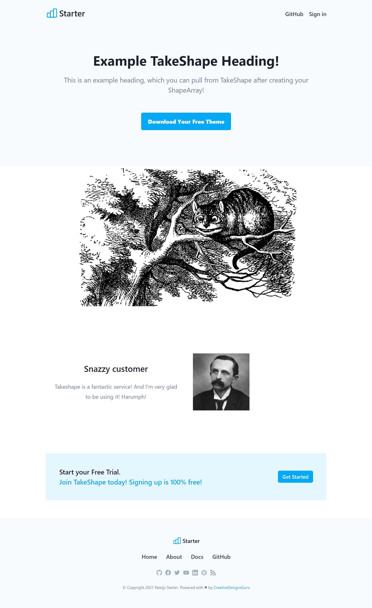

# TakeShape Starter Landing Page Shape Array

The following is a guide to launching a Landing Page Shape Array Example project that injects Shape Array data into a NextJS template.

To learn more about the template, read the [template's TEMPLATE-README file](./TEMPLATE-README.md).

## Instructions

1. Create a TakeShape project with the pattern in this repo. The button below will deploy the project:

* 

2. Follow our documentation to [create a read-only API Key](https://app.takeshape.io/docs/api/api-keys).

3. Find your API Endpoint by navigating to your project in the TakeShape web client and clicking on the Home tab. Scroll down, and you'll see your API Endpoint in the `Useful Snippets` section on the bottom right. Refer to the image below:

4. In the terminal on your local machine, clone this repo with `git clone https://github.com/takeshape/takeshape-starter-shape-array`

5. Cd into the newly-created project directory, and run `npm install

6. Open the project directory in your favorite IDE, then edit `.env.local-example` to replace the text that says `YOUR-ENDPOINT-HERE` with your API Endpoint. Replace the text that says `YOUR-API-KEY-HERE` with your API Key. When you're done, rename the file to `.env`.

6. Run `npm run dev` in your console.

6. Open `localhost:3000` in your browser.

6. Viola! Your template should be working!

## Learn More

Check out [our docs on this project](https://app.takeshape.io/docs/data/recipes/landing-page) to learn how this example works.